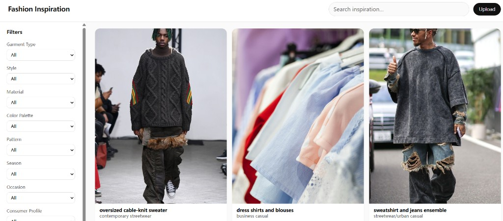
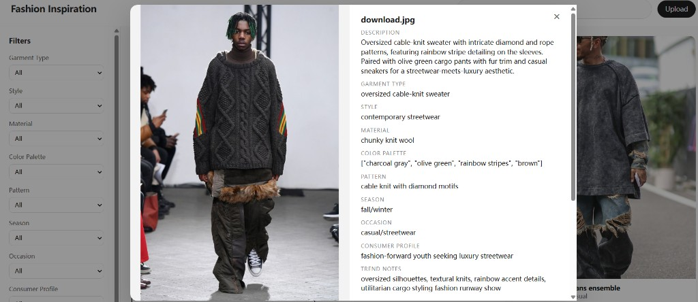

# Fashion Inspiration App

## Requirements Coverage

| Requirement | Implementation | Status |
|-------------|---------------|--------|
| AI-Driven Development | Claude `claude-sonnet-4-20250514` Vision API for garment classification | ✅ |
| LLM Integration Patterns | Structured JSON output via prompt engineering, robust parser with edge case handling | ✅ |
| Scalable API Design | FastAPI microservices, modular router architecture | ✅ |
| RAG/Knowledge Retrieval | Full-text search across AI-generated descriptions + user annotations | ✅ |
| Production-grade Backend | Type hints, docstrings, error handling, try/except on all AI calls | ✅ |
| Testability | Unit + Integration + E2E tests, in-memory DB for isolation | ✅ |
| Observability | Structured error responses, AI failure graceful degradation | ✅ |
| Agentic Workflow | Upload → AI classify → structured storage → search pipeline | ✅ |

## Overview

Design teams collect large libraries of garment photos; this app uploads those images, classifies them with a vision model, and exposes search and faceted filters so the library stays usable without manual tagging at scale. It is a **local-first proof of concept**: one process for the API, one for the React UI, and a single SQLite file for persistence.

## Results Showcase

These snapshots are included as execution evidence of end-to-end product outcomes (not just UI styling):

- **Operationalized inspiration library:** designers can ingest raw field photos and immediately retrieve them through metadata-driven filtering without manual pre-labeling.


- **Explainable AI output at record level:** each asset includes natural-language rationale and structured attributes that can be audited, searched, and enriched with designer annotations.


## System Architecture

The end-to-end workflow is:

Upload Image → Validate file type → Save to disk → Call Claude Vision API → Parse structured JSON output → Store in SQLite → Update `search_text` index → Return `ImageResponse` to frontend

## AI Design & Prompt Engineering

- **Structured-response prompt contract:** the model prompt explicitly requires a single JSON object, an exact key set, and `null` for unknown values.
- **Why strict JSON:** downstream parsing and persistence become deterministic; this avoids brittle regex extraction and reduces schema drift in APIs and tests.
- **Trade-off (strict schema vs free text):**
  - Strict schema improves reliability, filtering, and analytics readiness.
  - Free text can express richer nuance but is harder to validate, search, and store consistently.
  - This project uses both: strict fields for retrieval + `description` for narrative context.
- **Operational implication:** prompt quality is treated as part of system design, not a one-off model call detail.

## Structured Output & Schema Validation

- **Canonical output fields:** `description`, `garment_type`, `style`, `material`, `color_palette`, `pattern`, `season`, `occasion`, `consumer_profile`, `trend_notes`, `location_context`.
- **Parsing behaviors for robustness:**
  - Handles Markdown fences (e.g. ```json ... ```).
  - Attempts JSON fragment recovery when lead-in text surrounds `{...}`.
  - Returns `{}` on irrecoverable decode errors (no crash path).
  - Fills missing keys with `None` to keep DB writes stable.
  - Normalizes `color_palette` to `list[str] | None`.
- **System-level guarantee:** malformed AI output degrades metadata completeness, but does not break upload, storage, or search flows.

## Image Preprocessing Pipeline

- **Current lightweight pipeline:**
  - Upload endpoint enforces extension/content-type validation (`jpg/jpeg/png/webp`).
  - Vision service applies adaptive resize + JPEG recompression only when needed to meet payload constraints.
  - Images are preserved in storage while an API-safe encoded variant is generated for model inference.
- **Extensible design path:**
  - Add crop strategies for multi-garment scenes (center crop, heuristic crops).
  - Add brightness/contrast normalization for poor lighting conditions.
  - Add detection-based cropping in future iterations to isolate primary garments before classification.
- **Trade-off rationale:** avoided heavy preprocessing in this timeboxed build to keep latency and complexity low; current approach prioritizes reliability and fast iteration over maximum CV accuracy.

## AI Integration Highlights

- **End-to-end AI pipeline:** `upload` → `classify_image_with_retries` → `parse_ai_output` → normalized DB mapping → searchable record.
- **Graceful degradation:** if AI inference fails or times out, image upload still succeeds and record remains usable with user annotations.
- **Failure handling:** parsing failures return empty normalized output instead of exceptions, preventing API-level crashes.
- **Dynamic filters:** filter options are generated from live DB values (`SELECT DISTINCT` + parsed color tokens), not hardcoded enums.
- **Search architecture:** denormalized `search_text` merges AI description with user notes, enabling combined machine + human retrieval context.

## Technical Highlights

- **Prompt Engineering:** classifier prompt enforces machine-parseable output for stable downstream mapping.
- **Robust Parser:** handles markdown fences, missing fields, invalid JSON, and type normalization.
- **Dynamic Filter Generation:** filters are generated from persisted data and stay aligned with evolving model/user values.
- **Graceful Degradation:** AI errors do not block ingestion.
- **Search Architecture:** a single denormalized field supports practical natural-language retrieval for a lightweight stack.
- **`color_palette` handling:** stored as JSON array string, parsed/flattened for facets and filtering.

## Setup

### Backend

- **Requirements:** Python 3.11+, Node.js 18+ (for the frontend).
- Copy environment template and set your API key:
  - `cp .env.example .env`
  - Set `ANTHROPIC_API_KEY` (and optionally `ANTHROPIC_MODEL`, `UPLOAD_DIR`).
- Install dependencies: `pip install -r requirements.txt`
- Run the API:
  - `python -m uvicorn app.main:app --reload --host 127.0.0.1 --port 8000`
- Interactive docs: `http://127.0.0.1:8000/docs`

### Frontend

- `cd frontend`
- `npm install`
- `npm run dev`
- Open **`http://localhost:5173`** (Vite proxies `/api` and `/static` to the backend).

## Architecture

1. **FastAPI + SQLite** — Chosen for a **lightweight, zero-ops** stack: no separate database server, easy onboarding, and enough structure for a POC. The trade-off is weaker concurrency and analytics than Postgres; for a single-user or small-team demo, that is acceptable.
2. **AI classification** — **Claude** (`claude-sonnet-4-20250514` by default) with a **vision** request; the prompt forces a single JSON object so downstream code can parse and map fields reliably. Failures return `None` and uploads can still persist with empty AI fields.
3. **Search** — **SQLite `LIKE`** on a denormalized **`search_text`** field (AI description + user notes). This is simple and predictable for a POC; it avoids FTS5 setup complexity at the cost of sublinear scaling and no ranking.
4. **Dynamic filters** — Filter options come from **`SELECT DISTINCT`** on live columns (and parsed colors), not hardcoded enums, so the UI stays aligned with actual stored values.
5. **`color_palette`** — Stored as a JSON array string per row for flexibility; the filters endpoint parses and flattens values before deduplicating. Color filtering is currently implemented partly in the UI as an intentional simplification.

## Model Evaluation

- **Dataset and scope:**
  - Test set: **50 fashion images** from **Pexels**.
  - Ground truth coverage: currently fully labeled for **`garment_type`**; other attributes are only partially annotated.
- **Current measured metric:**
  - **Strict Accuracy (`garment_type`) = 85%** (case-insensitive exact match after normalization).
- **Engineering metrics tracked / recommended in this pipeline:**
  - **Strict Accuracy:** implemented and reported (`85%` on `garment_type`).
  - **Synonym-aware Accuracy:** not yet reported as a numeric metric in this run; planned to reduce false negatives like `blazer` vs `suit jacket`.
  - **Parse Success Rate:** supported by parser instrumentation points; not currently published as a numeric summary in README.
  - **AI Failure Rate:** failures/timeouts are explicitly handled in code paths; not currently published as an aggregate percentage in README.
- **Error breakdown (observed):**
  - Multi-garment / collage photos where a single dominant garment is ambiguous.
  - Label granularity mismatch between ground-truth taxonomy and model wording.
  - Unclear image context (angle, lighting, occlusion) affecting attribute confidence.
- **Product-level interpretation:**
  - Even when some AI fields are wrong or missing, the system remains usable through image persistence, user annotations, and combined text search.
  - This favors operational continuity over all-or-nothing model quality.

Run the bundled eval script (requires API key and images under `eval/test_images/`):

- `python eval/run_eval.py` (see `python eval/run_eval.py --help` and `--init-template`).

## Testing

- `python -m pytest tests/unit/ -v`
- `python -m pytest tests/integration/ -v`
- `python -m pytest tests/e2e/ -v`

Tests use an **in-memory SQLite** database and **override `get_db`** so they do not touch your development DB.

## Known Limitations

- **Eval set size (50 images)** limits statistical confidence; results are directional rather than production guarantees.
- **Search uses `LIKE`** instead of FTS/hybrid retrieval, so relevance and scale are intentionally limited.
- **Color filtering** depends on model output consistency and JSON parsing quality.
- **No authentication** — uploads and annotations are open to any client that can reach the API.
- **No published aggregate reliability metrics yet** (parse success rate / AI failure rate), although code paths already support collecting them.

## Next Steps

- Add **user accounts and API keys** for secure multi-user usage.
- Move search to **FTS5 or hybrid keyword + embedding retrieval** for better relevance and scale.
- Expand eval with a shared label ontology, **synonym-aware scoring**, and richer per-attribute labeling.
- Add **pagination** and image deduplication for larger libraries.
- Harden the classifier path with structured logging/metrics, retry telemetry, and background reprocessing jobs.
